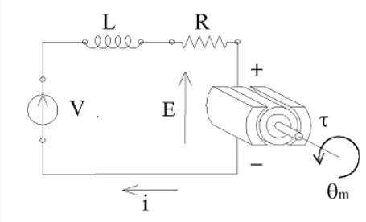
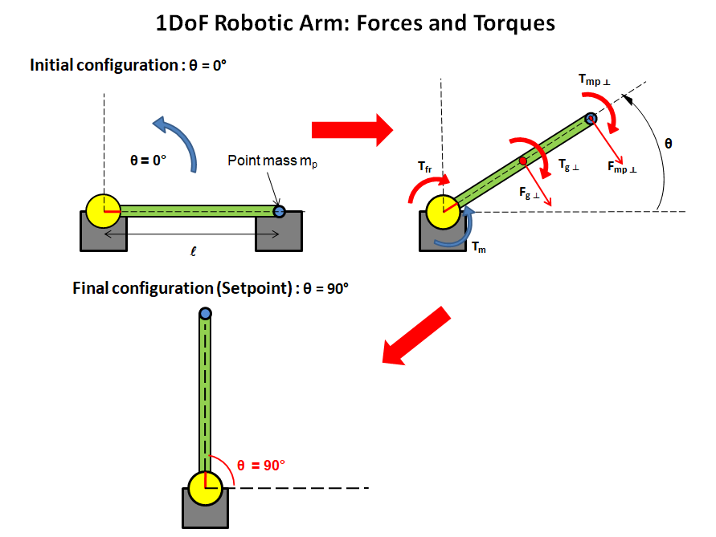
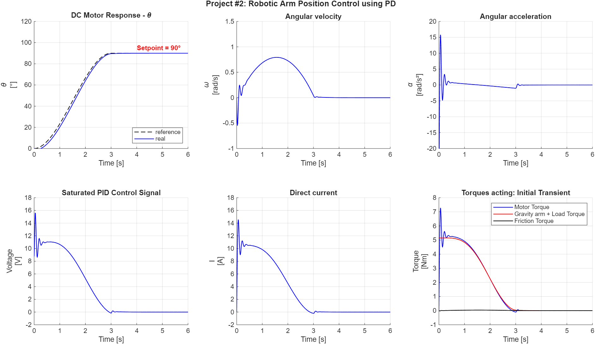

# Closed-Loop PD Control of 1-DOF Robotic Arm with Gravity Compensation
PD-based position control of a robotic arm driven by a DC motor, implemented in MATLAB/Simulink.

## Project Overview
This project implements a **PD controller** for **angular position control of a robotic arm** driven by a DC motor using **MATLAB** and **Simulink**.  
This project demonstrates:
- Modeling a DC motor for position control
- PD controller design and tuning
- System dynamics simulation in Simulink

**Figure 1 – DC motor model**

---
## Simulation Case
The system consists of:
- 0.3 m long arm with a mass of 1.5 kg
- 1 kg point mass at its tip.

This project simulates the motion of a 1-DOF robotic arm from 0° to **90°** under PD control with a smooth S-curve trajectory, including the effect of a point mass at the tip.
The objective is reaching 90° within 3 seconds from start, with a smooth, non-aggressive velocity profile.

**Figure 2 – 1-DoF Robotic Arm rotation**

---
### System Model

The DC motor and robotic arm are modeled using standard equations.

**Electrical equation (Kirchhoff's Voltage Law):**

$$
V(t) = L \frac{di(t)}{dt} + Ri + K_b \frac{d\theta(t)}{dt}
$$

**Mechanical equation (Work-Energy Theorem):**

$$
K_t i(t)- b \frac{d\theta(t)}{dt}-(m_{arm}\frac{l}{2}+m_{p.m}l) g cos\theta = J_{tot} \frac{d^2 \theta(t)}{dt^2}
$$

Where: 

- $$\ \theta(t) \$$ = angular position of the arm [rad]  
- $$\ \frac{d\theta}{dt} \$$ = angular velocity [rad/s]  
- $$\ \frac{d^2\theta}{dt^2} \$$ = angular acceleration [rad/s²]  
- V(t) = input voltage  
- i(t) = armature current  
- J_{tot} = total system inertia  
- b = friction coefficient 
- R, L = armature resistance and inductance  
- $$K_t$$ = motor torque constant  
- $$K_b$$ = back EMF constant
- $$m_{arm}$$ = arm mass
- $$m_{p.m}$$ = point mass at the tip

The **angular position θ(t)** of the arm is obtained by integrating the angular velocity ω(t).

---
### Control Strategy

A **PD (Proportional-derivative) controller** regulates the angular position of the arm.

**PD law:**

$$
u(t) = K_p e(t) + K_d \frac{de(t)}{dt}
$$

Where:
- $$e(t) = θ_{desired}(t)$$ - $$θ_{actual}(t)$$ (position error)  
- $$K_p$$ = proportional gain  
- $$K_d$$ = derivative gain

The PD gains were tuned iteratively to achieve a compromise between fast response and stability.
Increasing Kp reduced rise time but introduced oscillations, while Kd improved damping and reduced overshoot.
No integral action $$(K_i)$$ is required.

---

## Simulink Model

The Simulink model includes:
- DC motor dynamics
- S-curve reference input to command a **90° rotation** 
- Angular position feedback  
- PD controller block
- Gravity feedforward compensation (percentage-based)
  
---

## Results

Simulation results show:
- **Position, velocity and acceleration response** over time  
- **Control voltage signal** including PD action and gravity feedforward, and **current**
- **Driving and resistive torques** 

Typical performance metrics:
- **Rise time** = 3s
- **Overshoot**: none 
- **Steady-state error**: negligible (≈0)

Plots and Simulink-screenshots are stored in the `results/` folder.

**Figure 3 – Simulation results**

---

## Observations from Simulations

From the simulation, it can be observed that:

- The PD controller, assisted by percentage-based gravity compensation, handles the transient smoothly
- A small initial negative peak of ≈1.5° occurs due to inertia.
- Even if a tip mass is included, the controller maintains accurate positioning.
- No integral term is used as steady-state error remains minimal (≈0).
- The arm reaches the target within the 3-second motion time and stabilizes quickly, with no overshoot.
- The control voltage, motor current, and generated torque remain within practical limits, indicating the system could be realistically implemented.

---

## Tools Used

- **MATLAB / Simulink** – for modeling, simulation and plotting

---

## Possible Improvements

- Automatic PD tuning (using MATLAB PD Tuner)  
- Real hardware testing on robotic arm  
- Extended simulations with varying loads and disturbances

---

## Repository Structure

The repository contains:

| Folder   | Contents                         |
| -------- | -------------------------------- |
| model/   | Simulink model (.slx)            |
| scripts/ | MATLAB and Python parameter scripts         |
| results/ | Simulation plots and screenshots |
